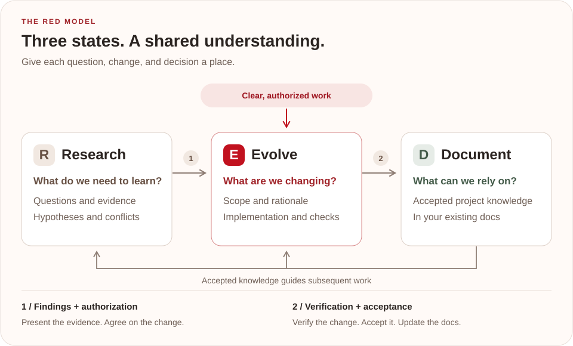

<p align="center">English · <a href="README.zh-CN.md">简体中文</a></p>

<p align="center">
  
</p>

<h1 align="center">Give project knowledge a state.</h1>

<p align="center">
  Keep open questions, ongoing changes, and accepted knowledge distinct.<br>
  A project-knowledge methodology for AI-assisted engineering.
</p>

<p align="center">
  <a href="#quick-start">Quick start</a> ·
  <a href="#one-change-through-red">See an example</a> ·
  <a href="methodology/introducing-red.en.md">Read the paper</a> ·
  <a href="methodology/introducing-red.md">中文论文</a>
</p>

<p align="center">
  <a href="spec/protocol.md"></a>
  <a href="LICENSE"></a>
  <a href="red.toml"></a>
</p>

An AI agent needs to know which ideas are still being investigated, which changes are underway, and which decisions it can rely on. RED makes those states explicit in the project:

<p align="center">
  <a href="docs/assets/red-flow.svg"></a>
</p>

Document lives in your existing project documentation. Source code, tests, configuration, and runtime output provide implementation evidence. When that evidence conflicts with Document, RED makes the conflict explicit in Research so an authorized decision can resolve it.

## Quick start

From the project where you want to use RED, install the Skill with [skills](https://github.com/vercel-labs/skills):

```sh
npx skills add exoticknight/red --skill red
```

Choose your target agent during installation, or specify it with `--agent codex` (for example). Add `--global` for a user-level installation. This installs the Skill from this repository; the RED CLI is optional.

You can also install a release-matched Skill with the RED CLI:

```sh
npx -y @exoticknight/red@latest skill install --scope repo
```

Or with Python:

```sh
pipx run --spec red-methodology red skill install --scope repo
```

Both RED CLI runners install the same Skill into `.agents/skills/red`. Once your agent has loaded the installed Skill, start with a request such as:

> Use RED to inspect this project. Identify the accepted documentation, surface unresolved questions, and recommend the smallest useful adoption setup.

The **Skill** guides the agent's work. The **CLI** handles deterministic operations such as configuration, artifact creation, and validation. These one-shot commands install the Skill; for a permanent `red` command, see [CLI setup](#cli-setup).

## One change through RED

Suppose an API sometimes serves stale results. A small change might look like this:

1. **Research — investigate the cause.** “Does the cache survive a settings update?” Capture observations and investigate invalidation. Present the findings and proposed scope, then obtain authorization to change the cache policy.
2. **Evolve — implement and verify.** Propose invalidation on settings updates. Record the rationale and acceptance conditions, implement the change, and verify the behavior. Present the evidence and proposed documentation update for acceptance.
3. **Document — record the accepted policy.** After acceptance, update the architecture guide: “Settings updates invalidate cached results.” Future work uses this policy as its baseline.

**Start where the work belongs.** A clear, authorized change can begin in Evolve. Use Research when an unknown could change the decision or its acceptance conditions. Research-to-Evolve and Evolve-to-Document transitions each require an explicit human decision or a decision source authorized by the project.

## Choose the smallest form

| Project situation | Recommended form |
|---|---|
| Normal use, deterministic project operations available | RED Skill + RED CLI |
| Strong agent, offline environment, or no Node/Python runtime | RED Skill only |
| Existing project that cannot add a Skill | Managed block in `AGENTS.md` |
| Agent reads standalone instructions but not Skills | `RED.md` |

There is one RED Skill, covering engineering work, adoption, inspection, and artifact handling. `red.toml` is optional until a project needs explicit, machine-readable path and policy mapping. See the [adoption guide](docs/adoption.md) for how to fit RED into an existing repository.

For lightweight adoption:

```sh
npx -y @exoticknight/red@latest instructions install --target AGENTS.md
npx -y @exoticknight/red@latest instructions export --output RED.md
```

The `AGENTS.md` command owns a marked block and preserves the rest of the file.

## CLI setup

Install either distribution for regular CLI use:

```sh
npm install -g @exoticknight/red
# Or, with Python:
pipx install red-methodology
```

Both expose `red`. Install the Skill if needed, then initialize explicit project configuration:

```sh
red skill install --scope repo
red init
red check --json
red status --json
```

`red init` creates `red.toml`. Edit its paths to match your existing documentation and choose where Research and Evolve artifacts belong. Each project chooses whether to keep working records local, track them in Git, or share them through issues and pull requests.

### Create and advance work

Create a Research artifact when a question needs investigation:

```sh
red new research --title "Unknown cache behavior"
```

After presenting the findings and receiving authorization, create the Evolve record. Use the identifier returned by the previous command; this example assumes `R-1`:

```sh
red promote R-1 --to evolve --title "Adopt cache policy"
```

For a clear change already authorized to begin in Evolve:

```sh
red new evolve --title "Clarify installation instructions"
```

After implementation is verified, the change is explicitly accepted, and the relevant documentation is updated, record the decision. This example assumes `E-1` and a configured Document path of `README.md`:

```sh
red promote E-1 --to document --accepted --verified --document README.md
```

The flags record acceptance and verification already supplied by a human or project-authorized process. The CLI checks that the declared Document exists and records synchronization on the Evolve artifact; the agent or maintainer writes the substantive documentation change. See the [CLI contract](spec/cli-interface.md) for the full command behavior.

### Keep the Skill current

For a Skill installed through `skills`, use:

```sh
npx skills update
```

This checks and updates Skills managed by `skills`. For a Skill installed through the RED CLI, upgrade the CLI package and then update its managed installation:

```sh
red skill update --scope repo
```

Use `--scope user` for an installation in your user-level `.agents/skills/red` directory. The installer records its release and protocol in `.red-install.json` to support status, update, and uninstall operations.

## Go deeper

- **Start with an introduction:** [和 AI 把想法做成项目：试试 RED（中文）](methodology/introducing-red.wechat.md).
- **Read the methodology:** *Introducing RED: A Methodology for AI Understanding* — [English](methodology/introducing-red.en.md) · [中文完整篇](methodology/introducing-red.md).
- **Adopt it in a project:** [Adoption guide](docs/adoption.md).
- **Read the rules:** [RED Protocol 1](spec/protocol.md) and [CLI contract](spec/cli-interface.md).
- **Explore the implementation:** [Architecture](docs/architecture.md), [contribution guide](CONTRIBUTING.md), and [release process](docs/releasing.md).

## RED runs on RED

This repository uses RED Protocol 1. Its [`red.toml`](red.toml) maps accepted documentation and local `research/` and `evolve/` workspaces. Research and Evolve records stay out of Git here; contributors use issues or pull requests to share working state. CI runs `red check --json` against the project configuration.

The canonical Skill is [`plugins/red/skills/red`](plugins/red/skills/red). Maintainers install a release-matched snapshot locally; see [maintainer setup](CONTRIBUTING.md#maintainer-setup).

```text
cli/
  node/                 npm distribution
  python/               PyPI distribution
  conformance/          shared cross-implementation fixtures
plugins/red/            skills-only Codex plugin
methodology/            original methodology paper
spec/                   normative protocol and machine-readable contracts
docs/                   accepted project documentation and visual assets
scripts/                validation and release tooling
```

## Versioning and license

Release tags use `vMAJOR.MINOR.PATCH`. The npm package, Python package, plugin archive, and Skill snapshot share that release version. Protocol compatibility is versioned separately by `red.toml`'s `version` field; the Skill does not carry an independent version number.

RED is licensed under the [Apache License 2.0](LICENSE).
