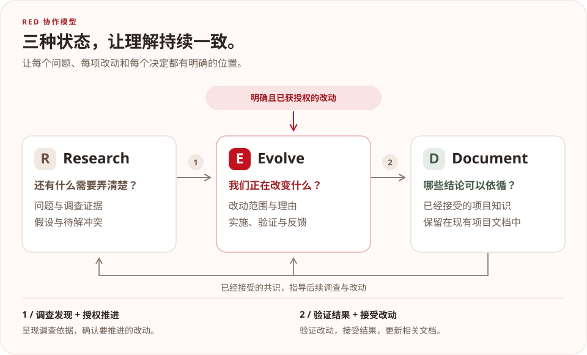

<p align="center">简体中文 · <a href="README.md">English</a></p>

<p align="center">
  
</p>

<h1 align="center">让项目知识有明确的状态。</h1>

<p align="center">
  分清还在探索的问题、正在推进的改动，以及已经接受的共识。<br>
  用于 AI 辅助工程的项目知识方法论。
</p>

<p align="center">
  <a href="#快速开始">快速开始</a> ·
  <a href="#用-red-推进一次改动">看一个例子</a> ·
  <a href="methodology/introducing-red.md">阅读完整方法介绍</a>
</p>

<p align="center">
  <a href="spec/protocol.md"></a>
  <a href="LICENSE"></a>
  <a href="red.toml"></a>
</p>

AI 需要知道：哪些想法还在调查，哪些改动正在推进，哪些决定已经可以依循。RED 在项目中明确这些状态：

<p align="center">
  <a href="docs/assets/red-flow.zh-CN.svg"></a>
</p>

Document 就在项目现有的文档里。源代码、测试、配置和运行结果提供实现证据。当这些证据与 Document 冲突时，RED 将冲突明确记录在 Research 中，交由有权作出决定的人或流程处理。

## 快速开始

在准备使用 RED 的项目目录里，用以下任一方式安装 Skill：

```sh
npx -y @exoticknight/red@latest skill install --scope repo
```

也可以使用 Python：

```sh
pipx run --spec red-methodology red skill install --scope repo
```

两种方式都会将同一份 Skill 安装到 `.agents/skills/red`。在支持从该目录加载 Skill 的 AI 工具中，可以这样开始：

> 用 RED 检查这个项目。找出已经接受的项目文档，列出尚未解决的问题，并建议最小可用的接入方式。

**Skill** 指导 AI 如何工作。**CLI** 负责配置、创建记录和校验等确定性操作。上面的临时运行命令用于安装 Skill；如需长期使用 `red` 命令，见 [CLI 安装与配置](#cli-安装与配置)。

## 用 RED 推进一次改动

假设某个 API 偶尔返回过期结果，一次小改动可以这样推进：

1. **Research——调查原因。** “设置更新后，缓存是不是还保留着？”记录观察结果，调查缓存失效机制。呈现发现和建议范围，获得修改缓存策略的授权。
2. **Evolve——实施并验证。** 提出在设置更新时使缓存失效的方案。记录理由和验收条件，实施改动并验证行为。提交验证证据和拟更新的文档内容，等待接受。
3. **Document——记录已接受的规则。** 结果被接受后，更新架构说明：“设置更新会使缓存结果失效。”后续工作据此继续。

**从适合当前工作的状态开始。** 明确且已经获准的改动可以直接进入 Evolve。当未知问题可能改变决定或验收条件时，先开展 Research。Research 到 Evolve、Evolve 到 Document 的转换，都需要明确的人类决定，或项目已授权的决策来源。

## 选择合适的接入方式

| 项目情况 | 建议方式 |
|---|---|
| 常规使用，能够运行确定性的项目操作 | RED Skill + RED CLI |
| AI 能力较强、离线环境，或没有 Node/Python 运行环境 | 仅使用 RED Skill |
| 现有项目无法添加 Skill | 在 `AGENTS.md` 中安装受管理的指令区块 |
| AI 能读取独立指令文件，但不支持 Skill | `RED.md` |

RED 使用一份 Skill，覆盖工程工作、项目接入、检查和记录管理。在项目需要明确、可供机器读取的路径与策略映射之前，`red.toml` 是可选的。如何接入已有仓库，见[接入指南](docs/adoption.md)。

轻量接入可使用：

```sh
npx -y @exoticknight/red@latest instructions install --target AGENTS.md
npx -y @exoticknight/red@latest instructions export --output RED.md
```

安装到 `AGENTS.md` 的命令只管理带标记的区块，保留文件中的其余内容。

## CLI 安装与配置

选择任一发行包，安装日常使用的 CLI：

```sh
npm install -g @exoticknight/red
# 或使用 Python：
pipx install red-methodology
```

两者都提供 `red` 命令。按需安装 Skill，然后初始化项目配置：

```sh
red skill install --scope repo
red init
red check --json
red status --json
```

`red init` 创建 `red.toml`。根据项目现有文档调整路径，并指定 Research 和 Evolve 记录的位置。每个项目自行决定将工作记录保留在本地、纳入 Git，还是通过 issue 和 pull request 共享。

### 创建和推进工作

遇到需要调查的问题时，创建 Research 记录：

```sh
red new research --title "调查缓存行为"
```

呈现调查发现并获得授权后，创建 Evolve 记录。使用上一条命令返回的编号；此处假设为 `R-1`：

```sh
red promote R-1 --to evolve --title "调整缓存策略"
```

已经明确且获准的改动，可以直接创建 Evolve：

```sh
red new evolve --title "完善安装说明"
```

实现通过验证、改动被明确接受，并且相关文档已更新后，记录该决定。此处假设编号为 `E-1`，并且 `README.md` 已配置为 Document 路径：

```sh
red promote E-1 --to document --accepted --verified --document README.md
```

这些标志记录人或项目授权流程已经给出的接受和验证结果。CLI 检查声明的 Document 是否存在，并在 Evolve 记录中登记同步情况；具体文档内容由 AI 或维护者编写。完整命令行为见 [CLI 契约](spec/cli-interface.md)。

### 保持 Skill 更新

升级 CLI 包后，更新受管理的 Skill：

```sh
red skill update --scope repo
```

安装到用户级 `.agents/skills/red` 目录时，使用 `--scope user`。安装器在 `.red-install.json` 中记录发行版本和协议版本，用于状态检查、更新和卸载。

## 进一步了解

- **先读一篇介绍：**[和 AI 把想法做成项目：试试 RED](methodology/introducing-red.wechat.md)。
- **了解完整方法：** *Introducing RED: A Methodology for AI Understanding* — [中文完整篇](methodology/introducing-red.md) · [English](methodology/introducing-red.en.md)。
- **接入项目：**[接入指南](docs/adoption.md)。
- **查阅规则：**[RED Protocol 1](spec/protocol.md) 与 [CLI 契约](spec/cli-interface.md)。
- **参与开发：**[架构说明](docs/architecture.md)、[贡献指南](CONTRIBUTING.md)和[发布流程](docs/releasing.md)。

## RED 使用 RED 维护

本仓库采用 RED Protocol 1。[`red.toml`](red.toml) 映射已接受的文档，以及本地的 `research/`、`evolve/` 工作目录。这里的 Research 和 Evolve 记录不纳入 Git；贡献者通过 issue 或 pull request 共享工作状态。CI 根据项目配置运行 `red check --json`。

Skill 的源文件位于 [`plugins/red/skills/red`](plugins/red/skills/red)。维护者在本地安装与发行版本匹配的快照，详见[维护者配置](CONTRIBUTING.md#maintainer-setup)。

```text
cli/
  node/                 npm 发行包
  python/               PyPI 发行包
  conformance/          两种实现共用的一致性用例
plugins/red/            仅包含 Skill 的 Codex 插件
methodology/            原创方法论文章
spec/                   协议规范与机器可读契约
docs/                   已接受的项目文档与视觉素材
scripts/                校验与发布工具
```

## 版本与许可证

发行标签采用 `vMAJOR.MINOR.PATCH`。npm 包、Python 包、插件归档和 Skill 快照使用同一个发行版本。协议兼容性由 `red.toml` 的 `version` 字段单独标识；Skill 没有独立的版本号。

RED 使用 [Apache License 2.0](LICENSE) 许可证。
