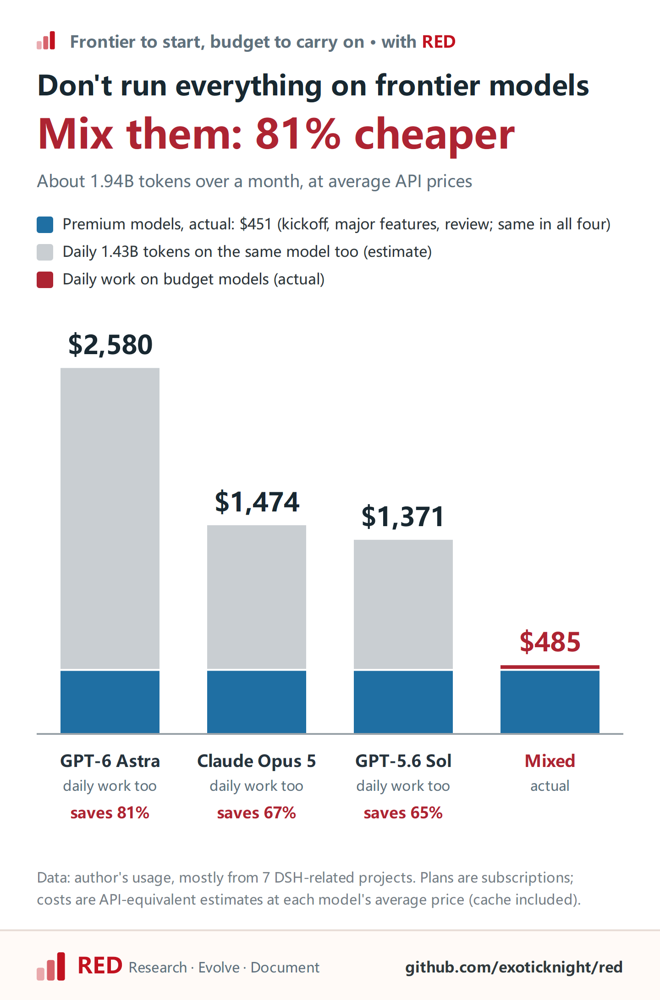
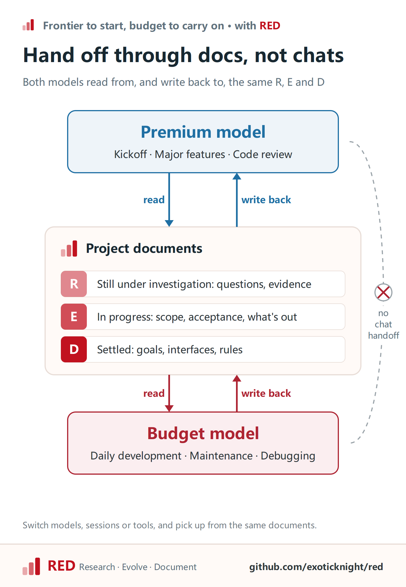
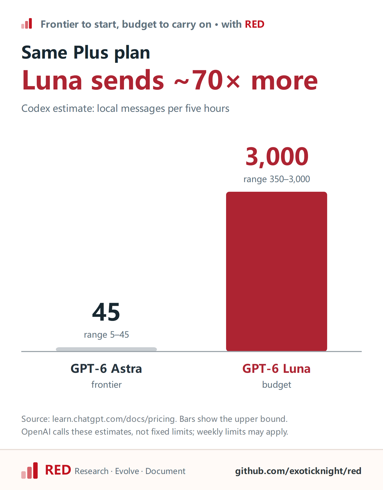

# Seven Projects In: Frontier Models Start, Budget Models Carry On, and My Costs Fell 80%

Over the past month or so, I had budget models burn through 1.4 billion tokens. At API prices that comes to **$34**. The same volume at GPT-6 Astra's average price would be about **$2,100**.

Those tokens went into seven projects I had open at the same time, and the budget models never drifted off course:

- [dsh-work](https://github.com/dsh-work-dev/dsh-work): a desktop app for DSH, still in development
- [dsh-plugin-template](https://github.com/exoticknight/dsh-plugin-template): a plugin template that lets an AI create, release and list a DSH plugin from one sentence
- [dsh-system1](https://github.com/exoticknight/dsh-system1): a foundation service that gives other plugins fast judgment calls
- [dsh-just-chat](https://github.com/exoticknight/dsh-just-chat): one click opens a conversation in its own workspace
- [dsh-labnana](https://github.com/exoticknight/dsh-labnana): text-to-image, image-to-image and image editing inside a chat
- [dsh-theme-eink-retro](https://github.com/exoticknight/dsh-theme-eink-retro): a paper-and-ink interface theme
- [haiku-by-haiku](https://haiku-by-haiku.com): a daily haiku site in English, Chinese and Japanese

My split is simple. Early discussion and specs, the occasional major feature, and code review go to the GPT-6 Astra and Claude Opus tier. Everyday development goes to budget models like GPT-6 Luna (reasoning set to max) and DeepSeek V4.1 Flash, which cost 1% to 2% of the top tier per token.

Anyone can mix a strong model with a cheap one. The hard part is keeping the cheap model on track over time: across new sessions, across tools, after a few weeks away, it still has to know what has already been decided. For that I rely on RED, an open-source methodology for AI-assisted development.

## The bill



| Role | Models | Tokens | Cost |
|---|---|---|---|
| Kickoff, major features, review | Astra, Opus, Fable, Sol | ~510M | ~$451 |
| Everyday development | Luna, DeepSeek Flash | ~1.43B | ~$34 |
| **Total** | | **~1.94B** | **~$485** |

Had those 1.43 billion everyday tokens also gone to Astra, that part alone would be the roughly $2,100 from the opening, and the total would be $2,580. The actual $485 is 81% less. Even mid-tier models like GPT-5.6 Sol or Claude Opus 5 would put the total around $1,400, close to three times what I paid.

A per-model breakdown is in the appendix.

## What RED is

RED does two things: it keeps project knowledge organized by state, and it has the AI choose its next step by that state. The three states:

- **R (Research)**: open questions and the evidence gathered so far. When an unknown could change a decision, the AI investigates before acting.
- **E (Evolve)**: the change in progress. What changes, why, how it will be accepted, and what is out of scope. Within that scope, the AI gets on with the work.
- **D (Document)**: what has been settled. Goals, interfaces, architecture, rules. The AI follows it; changing it means stopping for a person to confirm.

RED doesn't care which model writes these records. Whoever does the work reads and updates them. In my setup the premium model makes decisions, orchestrates tasks and reviews results, while the budget model executes and writes code. Both read R, E and D, and both write back their findings, progress and conclusions.



## Two real projects

First, dsh-system1. I kicked it off with Opus in Claude Code and worked through the goals, boundaries and architecture. Opus wrote five R records and two E records. The E listed six deliverables and spelled out what was out of scope: reference strategies, agent tools, a CLI, MCP, a stats dashboard, all "moved out of this delivery". That phase used about 4.9 million tokens, or **$5.7**.

Then I switched to Codex and handed the project to GPT-6 Luna. The two tools share no sessions. Luna could pick up the work only because Opus had written the decisions into RED. It started from D and E, needed not one sentence of background from me, and carried the work through code, tests and a packaged release. About 29 million tokens, or **$0.47**.

Luna used six times the tokens Opus did, for less than a tenth of the cost.

Next, dsh-work. In one of its sessions, Astra ran the first 11 turns to set the direction and then handed over to GPT-5.6 Luna. Over its 16 turns, Luna made 1,705 tool calls and the context was compacted 14 times. In the longest single turn, it made 601 tool calls in a row over 2 hours 45 minutes, went through 5 compactions, and never lost track of the task.

Mixing strong and cheap models is not a new idea. Anthropic's [advisor tool](https://claude.com/blog/the-advisor-strategy), launched in April, has Haiku do the work and consult Opus on hard calls; on BrowseComp that lifted Haiku from 19.7% to 41.2%, at about 15% of the per-task cost of running Sonnet alone. A September [paper that tested 176 agent configurations](https://arxiv.org/abs/2609.20804) says much the same: planning ahead protects accuracy for weaker models and mostly saves money for stronger ones.

But in all of these, the handoff happens inside a single call or a single session. A real project runs for weeks, and whatever the premium model worked out has to stay available the whole time. That is the part RED takes care of.

## Two sentences a day

Once a project is underway, the budget model drives the everyday work on its own: maintenance, new features, debugging. It also writes the research and change records. When I hand it something, I usually say two things:

> Here is the problem. Here is what I want.

I rarely have to explain how. What to read first, whether to investigate, how to check the result: the RED workflow already covers it. I don't have to keep reminding it that "we agreed not to change the default behavior", either. That is already in D and E.

I can drop in a question at any point, like "why is this module designed this way?", and it answers and returns to what it was doing instead of treating the question as a new task. The work in progress lives in E, and it checks new messages against E first.

Once a project is running, I bring the premium model back in two situations. One is a major feature, or the budget model getting stuck, where the work needs fresh investigation and trade-offs. The other is code review after a feature lands. Review is mostly reading and little writing, so it costs little, and it catches what the budget model missed.

## Give your AI a save file

If you use AI heavily, you have probably seen it: as a conversation grows long, the model gets dumber. It forgets rules and drops requirements. That isn't your imagination. An [analysis of 1,650 Claude Code sessions](https://arxiv.org/abs/2605.10039) found that later in a session, agents were more likely to miss requirements set in the configuration file.

Start a new session and it is sharp again. But what happens to everything the old conversation built up? How the direction was decided, which options were rejected, how far the work got: all of it stays behind in the old session.

Context compaction won't save you either. Compaction is a general-purpose mechanism; it doesn't know what matters in your project. Every vendor does it differently, and all of them are black boxes. You can't see what was kept and what was dropped, and the part you care about may be in what was dropped.

RED gives the AI a save file. Open questions, work in progress and settled decisions all go into project files instead of living in conversation memory:

- **A new session is a load from save.** It reads the relevant D and E and picks up where things left off, so the old session can be closed without worry.
- **What compaction drops can be loaded back.** RED's Skill tells the AI to reload missing material after compaction. That rule is why the dsh-work turn got through 5 compactions without drifting.
- **The save file works across tools.** I move between Claude Code, Codex and DSH; dsh-system1 started in Claude Code and continued in Codex. The tools share no sessions. The save file is the only thing they share.

> **Compaction deletes the chat history. The save file stays in the project.**

Switching between premium and budget models runs on the same save file. When I need stronger judgment, I bring in the premium model; once the hard part is past, I switch back. The dsh-work session above had Astra start and Luna continue, and RED's own repository has a session where Luna handed off to Astra midway. Model upgrades work the same way: dsh-work moved from GPT-5.6 Luna to GPT-6 Luna mid-project and carried on as usual.

## On a subscription, this matters even more

The bill above uses API prices. Most people are on a subscription instead, where hitting the limit means waiting for a reset.

Every vendor meters usage in time windows, and the model you pick decides how fast you burn through them. By [Codex's own estimates](https://learn.chatgpt.com/docs/pricing), on the same Plus plan you can send 5 to 45 messages to GPT-6 Astra every five hours, or 350 to 3,000 to GPT-6 Luna:



That is roughly 70 times more. I am on Pro myself, and I basically never run out of Luna.

Save the premium quota for the moments that need real judgment, and give the everyday work to budget models that barely touch your limits. With RED keeping track of what has been settled, the budget model stays on course.

## Try it

My examples are all about code, but RED isn't limited to programming, and neither is mixing models. The advisor test above used BrowseComp, which measures web research, not coding. Long-form writing, research and organizing material all work with the same steps.

You can get started in four steps.

**Step 1: install RED.** In your project directory, run:

```sh
npx skills add exoticknight/red --skill red
```

Pick your AI tool during installation, or name it with a flag like `--agent codex`. If you aren't writing code, a new folder works as the project directory.

**Step 2: start with your best model.** Open a session with the strongest model you have and say:

> Start this project with RED. I want to build… First help me pin down the goals, the boundaries, and the questions I haven't thought through yet.

It records the open questions as R, investigates them and shows you the findings, then writes the work as E: what to do, what not to do, and what counts as done. For a project that is already halfway along, say this instead:

> Adopt RED for this project. Look through the existing docs first and list what is still unresolved.

**Step 3: switch to a budget model.** Open a new session, pick a budget model and say "continue with RED". It reads D and E on its own, with no background briefing from you. From then on, assigning work takes the same two sentences as before: here is the problem, here is what I want.

**Step 4: make the call at two points.** When an investigation is done, RED stops and asks whether to act on it. When a change is done, it stops and asks whether to accept it. Only after you agree does the settled result go into D, where every future session will follow it.

The full guide is in the [RED repository](https://github.com/exoticknight/red).

## Appendix: usage breakdown

| Model | Tokens | Cost |
|---|---|---|
| gpt-6-astra | 98.5M | $146.37 |
| claude-opus-5 | 204M | $146.01 |
| claude-fable-5 | 44.7M | $81.02 |
| gpt-5.6-sol | 68.1M | $43.76 |
| claude-opus-5-5 | 94.0M | $33.38 |
| gpt-5.6-luna | 510M | $15.74 |
| deepseek-v4-flash | 739M | $15.47 |
| gpt-6-luna | 184M | $2.99 |

Data comes from my usage statistics, mostly spent on the seven projects above. Token counts include cache reads. I actually pay for subscriptions; costs are converted at the official API prices from [OpenAI](https://developers.openai.com/api/docs/pricing), [DeepSeek](https://api-docs.deepseek.com/quick_start/pricing) and [Claude](https://platform.claude.com/docs/en/about-claude/pricing).
