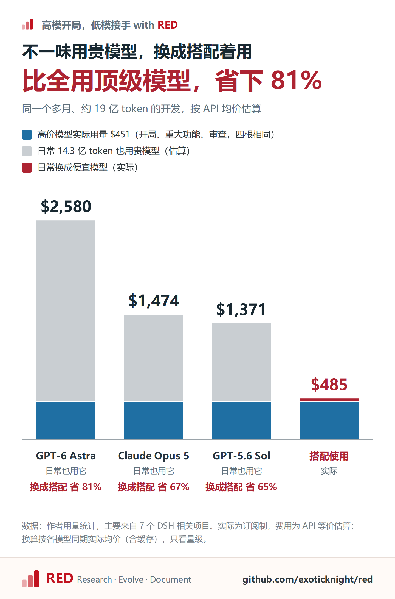
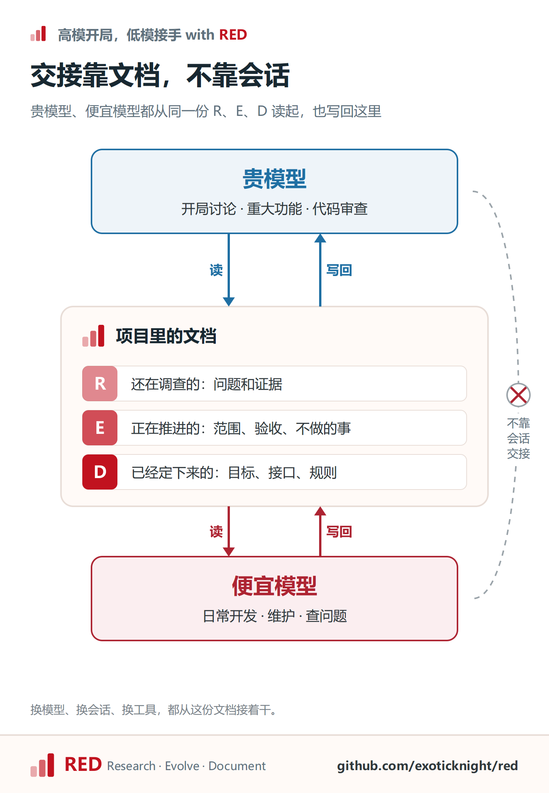
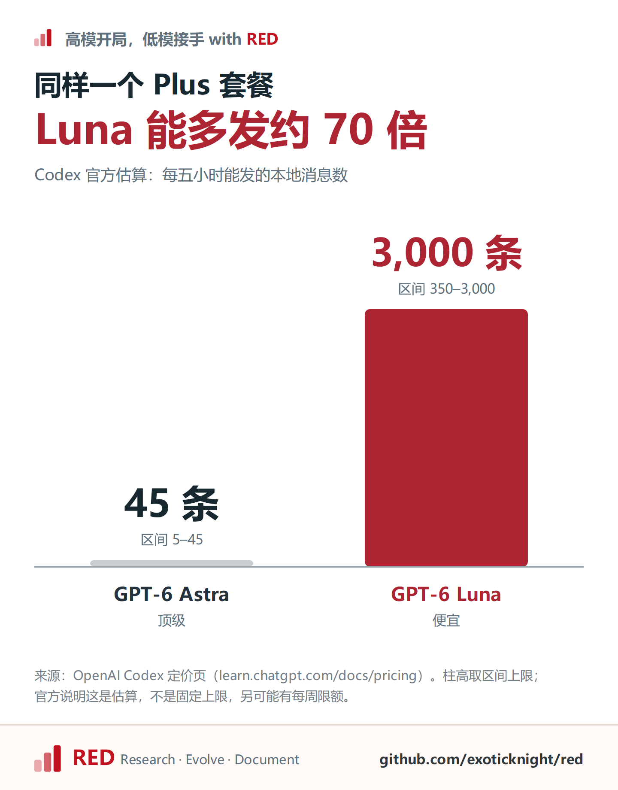

# 七个项目实测：顶级模型开局、低价模型接手，我让开发成本省了八成

这一个多月，我让便宜模型跑了 14 亿 token，折合 **$34**。同样的量按 GPT-6 Astra 的均价估算，大约 **$2,100**。

这些 token 花在我同时开着的七个项目上，便宜模型一路做下来，没跑偏过：

- [dsh-work](https://github.com/dsh-work-dev/dsh-work)：DSH 的桌面端，还在开发中
- [dsh-plugin-template](https://github.com/exoticknight/dsh-plugin-template)：插件模板，一句话让 AI 创建、发布、上架 DSH 插件
- [dsh-system1](https://github.com/exoticknight/dsh-system1)：给其他插件提供快速判断能力的基础服务
- [dsh-just-chat](https://github.com/exoticknight/dsh-just-chat)：点一下就开一段独立工作区的对话
- [dsh-labnana](https://github.com/exoticknight/dsh-labnana)：在对话里文生图、图生图、改图
- [dsh-theme-eink-retro](https://github.com/exoticknight/dsh-theme-eink-retro)：纸墨风格的界面主题
- [haiku-by-haiku](https://haiku-by-haiku.com)：每日一首俳句的中英日多语网站

我的分工很简单。项目起步时的讨论、规范，少数重大复杂功能，还有代码审查，交给 GPT-6 Astra、Claude Opus 这一档。剩下的日常开发，交给 GPT-6 Luna（推理开到 max）、DeepSeek V4.1 Flash 这类便宜模型，单价只有顶级模型的 1% 到 2%。

高低搭配谁都会，难的是让便宜模型长期接得住：换会话、换工具、隔几周回来，它还知道哪些事已经定了。这一点，我靠的是 RED，一套开源的 AI 辅助开发方法论。

## 先看账



| 角色 | 模型 | token | 费用 |
|---|---|---|---|
| 开局、重大功能、审查 | Astra、Opus、Fable、Sol | 约 5.1 亿 | 约 $451 |
| 日常开发 | Luna、DeepSeek Flash | 约 14.3 亿 | 约 $34 |
| **合计** | | **约 19.4 亿** | **约 $485** |

要是日常这 14.3 亿 token 也交给 Astra，光这部分就是开头说的约 $2,100，总账会是 $2,580；现在的 $485 省了 81%。就算换成 GPT-5.6 Sol、Claude Opus 5 这类中档模型，也要 $1,400 上下，差不多是现在的三倍。

分模型的明细放在文末附录。

## RED 是什么

RED 管两件事：项目知识按状态放好，AI 按状态决定下一步。三种状态是：

- **R（Research）**：还在查的问题和证据。碰到会影响决定的未知，AI 先查，不急着动手。
- **E（Evolve）**：正在做的改动。改什么、为什么改、怎么验收、哪些不做。AI 在这个范围里放手去做。
- **D（Document）**：已经定了的。目标、接口、架构、规则。AI 照着做；要改它，得停下来等人确认。

RED 不管这些内容由哪个模型来写，谁干活谁就读写它。在我的分工里，贵模型负责做决定、编排任务、审查结果，便宜模型负责执行、写代码；两边都会读 R、E、D，也都会把自己的调查、进度和结论写回去。



## 两个真实项目

先说 dsh-system1。开局我在 Claude Code 里用 Opus，把目标、边界、架构聊清楚。Opus 写了五份 R、两份 E。E 里列了六条交付内容，也写明了哪些不做：参考策略、agent 工具、CLI、MCP、统计看板，统统“移出本次交付”。这部分用了约 490 万 token，折合 **$5.7**。

然后我换到 Codex，交给 GPT-6 Luna。两个工具不共享任何会话，Luna 能接上，全靠 Opus 把定下的东西写进了 RED。它从 D 和 E 读起，项目背景一句不用我讲，一路写代码、跑测试，做到打出安装包。约 2,900 万 token，折合 **$0.47**。

Luna 跑的 token 是 Opus 的六倍，花的钱不到十分之一。

再说 dsh-work。它有个会话，Astra 先做了 11 轮，把方向定下来，再交给 GPT-5.6 Luna。Luna 接手的 16 轮里，调用了 1,705 次工具，上下文压缩了 14 次。其中最长的一轮，它连续调用 601 次工具，跑了 2 小时 45 分钟，中间压缩了 5 次，始终没有偏离任务。

高低搭配本身早有人验证过。Anthropic 今年 4 月推出的 [advisor 工具](https://claude.com/blog/the-advisor-strategy)让 Haiku 干活、碰到难题问 Opus，在 BrowseComp 上从 19.7% 提到 41.2%，每个任务的成本只有单用 Sonnet 的约 15%。9 月一篇[测了 176 种 agent 配置的论文](https://arxiv.org/abs/2609.20804)也说：事先规划，对弱模型能保住准确率，对强模型主要是省钱。

但这些做法的交接，都在一次调用、一次会话之内。项目一做就是好几周，贵模型想清楚的东西得一直留着，这正是 RED 在管的事。

## 平时只说两句话

项目起来以后，日常维护、新功能、查问题，都是便宜模型自己推进，调查记录和改动记录也是它自己写。我给它派活，通常只说两句：

> 现在有这个问题。我想要的效果是这样。

怎么做，基本不用教。先读哪些文档、要不要先调查、改完怎么检查，RED 的流程都规定好了。“之前说好了别改默认行为”这种话也不用反复提醒，都在 D 和 E 里。

中途随时插一句“这个模块为什么这么设计”，它答完就接着干手上的事，不会把问题当成新任务。因为手上的事记在 E 里，收到新消息，它会先和 E 对一遍。

项目起来以后，我请贵模型回来，多半是两种情况：碰上重大功能或者便宜模型卡住了，需要重新调查、权衡方案；一段功能写完，要做代码审查。审查读得多、写得少，花不了多少钱，却能挑出便宜模型漏掉的问题。

## 给 AI 存个档

AI 用得多了，你多半遇到过：对话一长，它就开始变笨，忘规矩、漏要求。这不是错觉。有人[分析了 1,650 个 Claude Code 会话](https://arxiv.org/abs/2605.10039)，同一个会话里，agent 越往后写，越容易漏掉配置文件里定好的要求。

开个新会话，它又聪明了。可之前聊出来的东西怎么办？方向怎么定的、哪些方案否掉了、做到哪一步了，全留在旧会话里。

指望上下文压缩也不靠谱。压缩是通用手段，不会针对你的项目判断什么该留；每家的机制又不一样，还都是黑箱。它留下了什么、丢掉了什么，你看不到。你觉得重要的东西，可能就在丢掉的那部分里。

RED 给了 AI 一个存档。还在查的、正在做的、已经定了的，都写进项目文件，不靠对话记忆：

- **开新会话，就是读档。** 新会话读完相关的 D 和 E 就能接着干，旧会话可以放心关掉。
- **压缩丢了东西，也能从档里读回来。** RED 的 Skill 要求 AI 压缩之后，把缺的材料重新读回来。dsh-work 那一轮压缩 5 次还没跑偏，靠的就是这一条。
- **换工具，存档照样能读。** 我在 Claude Code、Codex 和 DSH 之间换着用，dsh-system1 就是 Claude Code 开局、Codex 接手。几个工具不共享会话，共享的只有这份存档。

> **压缩删掉的是聊天记录，存档还在项目里。**

高低模型之间也靠这份存档切换。需要更强的判断，就换贵模型上；难点过了，再换回来。上面 dsh-work 那个会话是 Astra 先做、Luna 接手，RED 自己的仓库里也有 Luna 做到一半交给 Astra 的会话。模型升级也一样：dsh-work 做到一半，从 GPT-5.6 Luna 换成了 GPT-6 Luna，项目照常往下做。

## 买套餐的人，更该这么用

开头那笔账是按 API 价格算的。可大多数人买的是订阅套餐，额度一用完就只能等重置。

各家的额度都按时间窗口算，选哪个模型直接影响消耗快慢。按 [Codex 官方的估算](https://learn.chatgpt.com/docs/pricing)，同一个 Plus 套餐，每五小时 GPT-6 Astra 能发 5 到 45 条消息，GPT-6 Luna 能发 350 到 3,000 条：



差不多 70 倍。我自己用的是 Pro 套餐，Luna 基本用不完。

贵模型的额度留给真正需要判断的时候，日常交给几乎不占额度的便宜模型。有 RED 记着哪些事已经定了，便宜模型也不会乱来。

## 想试试

我举的例子都是写代码，但 RED 没规定只能用在编程上，高低搭配也一样：前面 advisor 那个测试，BrowseComp 考的是上网查资料，不是写代码。写长文、做调研、整理资料，照下面的步骤一样能用。

上手可以分四步走。

**第一步，装上 RED。** 在项目目录里运行：

```sh
npx skills add exoticknight/red --skill red
```

安装时选你用的 AI 工具，也可以用 `--agent codex` 这类参数直接指定。不写代码的话，新建一个文件夹当项目目录就行。

**第二步，用最好的模型开局。** 开一个会话，选你手上最强的模型，直接说：

> 用 RED 开始这个项目。我想做……，先帮我理清目标、边界和还没想明白的问题。

没想明白的问题，它会记成 R，查完把结论摆给你看，再把要做的事写成 E：做什么、不做什么、怎么算做完。已经做了一半的项目，就换成这句：

> 用 RED 接入这个项目。先看看现有的文档，列出还没解决的问题。

**第三步，换便宜模型接着做。** 开个新会话，切到便宜模型，说一句“按 RED 接着做”。它会自己去读 D 和 E，不用你再交代背景。之后派活，还是前面那两句：现在有什么问题，想要什么效果。

**第四步，在两个地方拍板。** 查完的问题要不要动手，做完的改动算不算数，RED 都会停下来等你决定。你点头之后，定下来的东西才写进 D，以后每个会话都照着做。

完整说明见 [RED 仓库](https://github.com/exoticknight/red)。

## 附录：用量明细

| 模型 | token 总量 | 折算费用 |
|---|---|---|
| gpt-6-astra | 9,850 万 | $146.37 |
| claude-opus-5 | 2.04 亿 | $146.01 |
| claude-fable-5 | 4,470 万 | $81.02 |
| gpt-5.6-sol | 6,810 万 | $43.76 |
| claude-opus-5-5 | 9,400 万 | $33.38 |
| gpt-5.6-luna | 5.10 亿 | $15.74 |
| deepseek-v4-flash | 7.39 亿 | $15.47 |
| gpt-6-luna | 1.84 亿 | $2.99 |

数据来自我的用量统计，大头花在上面七个项目上；token 含缓存读取，实际用的是订阅，费用按 [OpenAI](https://developers.openai.com/api/docs/pricing)、[DeepSeek](https://api-docs.deepseek.com/quick_start/pricing)、[Claude](https://platform.claude.com/docs/en/about-claude/pricing) 的官方 API 价格折算。
