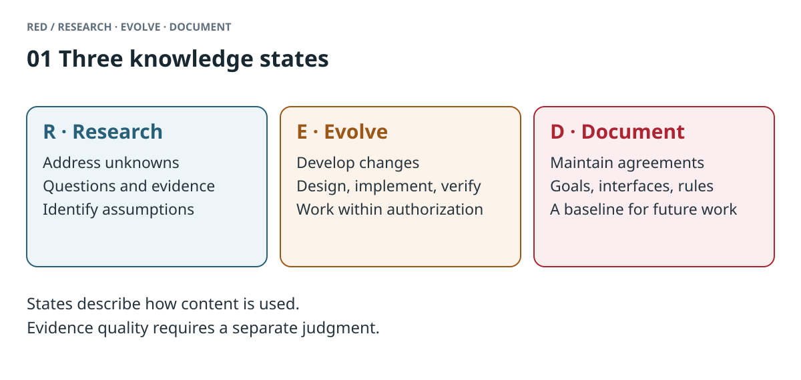
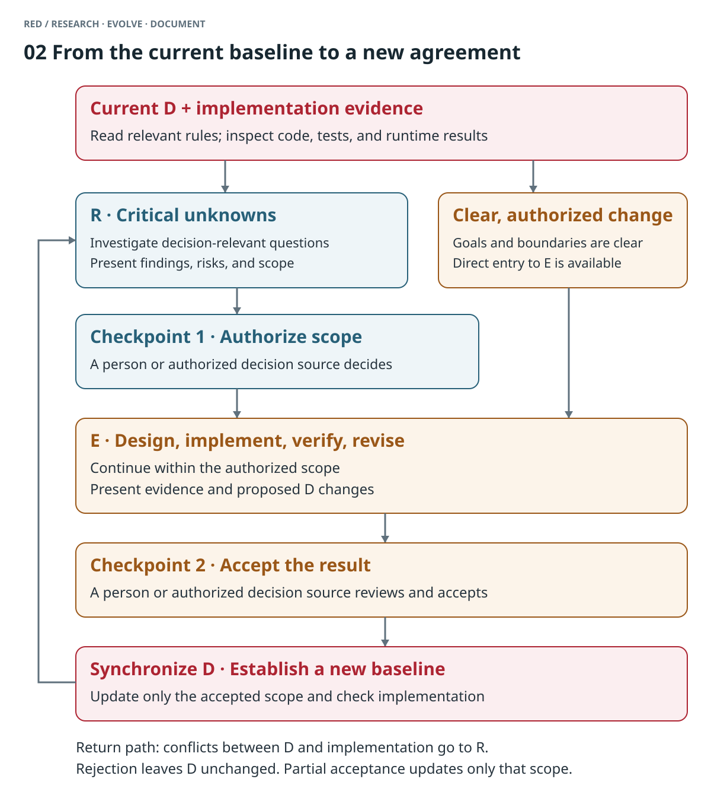
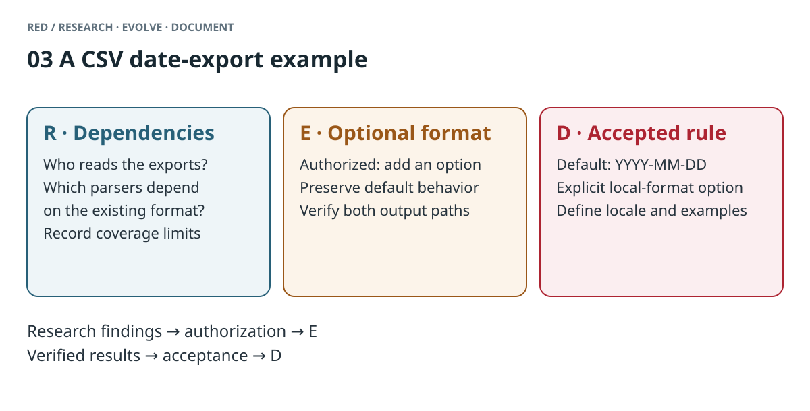

# Introducing RED: A Methodology for AI Understanding

You ask an AI to add CSV export to a project. The first conversation goes well, and the code passes its checks. Two weeks later, you ask it to add an exported field. It also changes the date format. A downstream program can no longer read the output. Looking back through the discussion, you find that the AI implemented an approach you had mentioned but never decided to adopt.

The AI found material relevant to the task and wrote code to match. It was missing the status of that material in the project: a question to investigate, a change in progress, or an established rule.

We have encountered this kind of problem throughout our AI programming work, which began after the release of GPT-4o. Pasting the README, refining prompts, and keeping conversation logs can help the current session. As a project evolves, we still find ourselves explaining which decisions remain valid and which ideas we have abandoned. **Keeping an AI's understanding of a project current and correct becomes an engineering problem of its own.**

We call our approach RED: Research, Evolve, Document. It organizes project content by knowledge state and defines how an AI should use that content, carry out work, and leave the results for the next collaboration.

## 1. Four recurring difficulties in AI collaboration

An AI's understanding of a project shows up in its next action. Ask it to modify a function, choose a dependency, or update documentation, and you find out what it is relying on.

**The AI loses track of the project's foundations.** In a new conversation, it does not know who the project serves or why you chose the current architecture. The offline requirement you explained never made it into the project documentation, so it recommends an approach that depends on an online service. The code may work while the project heads in the wrong direction.

**The AI confuses discussion with decisions.** You ask, “Should we consider supporting iOS?” In a later implementation, it adds interfaces for that possibility. Reviewing the material, you find both the idea and the confirmed requirements, but no account of how the discussion ended.

**You struggle to inspect the project understanding behind its actions.** The AI produces a design you did not expect. You have to work backwards: which rule did it follow, where did that constraint come from, and did it carry an assumption into the implementation? If the basis for its actions consists of scattered conversational clues, you must reconstruct its input before deciding what to correct.

**Conversations fail to reach a useful conclusion.** You and the AI analyze a problem and compare approaches at length. Next time, you may start over. Or you save every summary to prevent forgetting and end up with overlapping documents whose status is unclear.

These difficulties point to a gap: we supply the AI with project content without giving it an equally clear account of that content's knowledge state. Before carrying out a task, the AI must reconstruct which material it can use as a basis for action.

## 2. What is missing from the context

Consider a project summary handed to a new agent:

```text
CSV export uses YYYY-MM-DD.
We discussed local date formats; users might find them easier to read.
The format could follow the system locale.
Downstream programs read the CSV; compatibility still needs checking.
```

All four statements concern date export. The summary does not tell the agent which statement is the current agreement and which is a candidate approach. It also leaves the authorized scope unclear while compatibility remains unresolved.

People make these distinctions during collaboration. “Investigate this,” “Try this approach,” and “We have decided” permit different actions. We often leave those judgments in the conversation, then preserve only the subject matter in our documents.

The original record may contain enough clues for an AI to recover the decision. Later tasks must repeat that recovery. If a summary omits the decision, retrieval misses the relevant passage, or we have not yet made a decision, the AI has an incomplete basis for action.

RED records those judgments in the project's context structure. The same material can be expressed as:

```text
D / Current agreement
The default CSV date format is YYYY-MM-DD.

R / Under investigation
Which downstream programs depend on this format?
Which locale should a local format use?

E / Candidate change, not yet accepted
Add an explicit local-format option while preserving the default.
Confirm implementation scope after the compatibility investigation.
```

The agent can now distinguish behavior it must preserve, questions it should investigate, and a change still taking shape. Even if it encounters an old suggestion, it has a current agreement to check against.

Here, “state” describes the content's role in collaboration. Its factual reliability is a separate dimension: a runtime log in R may be reliable evidence, while D's description of the implementation may be outdated. We need both accurate evidence and decisions about what the project should follow. RED preserves the outcome of the latter judgment as explicit project knowledge.

## 3. The three layers of RED

RED separates project content into three layers according to knowledge state. Each corresponds to a different way for the AI to work.



*Figure 1. Content and purpose in R, E, and D. Evidence quality requires a separate judgment. [PNG version](assets/red-states.en.png).*

### R: Research, investigate unknowns

At the start of a project, we need to learn about users, technical feasibility, and existing systems. Later, we encounter unfamiliar code behavior, contradictory material, and new information that could change an approach. R holds these unknowns and the work of investigating them.

In R, the AI reads code, gathers material, and runs experiments while distinguishing observations, inferences, and assumptions. For example, inspecting an import script may confirm that one program uses a fixed date parser. A claim that other consumers do the same still needs evidence.

Research can remain incomplete or end without an answer. Preserve what you have learned, the coverage of the evidence, and the unknowns that affect the next decision.

Once the investigation supports a recommendation, the AI presents its findings, risks, and suggested scope, then waits for a person to decide whether to proceed with the change. **Finding a workable approach and obtaining authorization to implement it are separate steps.**

### E: Evolve, develop changes

E holds a change as it takes shape: why it is needed, the proposed approach, its scope, acceptance conditions, and open questions.

In E, you and the AI can compare approaches, write code, run tests, try the result, and revise it. Several approaches may coexist, and the AI can continue working within the authorized scope. You inspect the reasoning behind the proposal, the actual changes, and the verification results.

A clear problem and goal with authorization to implement can enter E directly. An unknown that could affect the choice or acceptance conditions calls for investigation in R first. If such an unknown appears during implementation, surface it and reconsider the remaining scope.

You may still revise or reject E's contents. The AI therefore needs to distinguish the approach it is developing from rules the project has accepted. After verification, it presents the results and proposed documentation update for acceptance by a person or a project-authorized process.

### D: Document, preserve accepted understanding

D preserves what the project has accepted and subsequent work should follow: project goals, core terminology, interfaces, architectural principles, usage, and engineering rules.

These can remain in your existing README, architecture descriptions, or API documentation. Identify which documents form the current baseline. At the start of a new task, the AI reads the relevant parts, then consults E, R, and implementation as needed.

This changes the starting point of a new conversation. The AI can establish what the project has already decided before investigating or changing the immediate subject. It need not reconstruct an agreement from the entire history first.

D needs maintenance as the project evolves. Changes to accepted understanding go through E and acceptance of the result; corrections and formatting edits that preserve meaning can proceed directly. Content entering D should have the verification and confirmation needed for continued use. Keep rationale that helps readers understand the conclusion, while leaving temporary discussion and work history in R/E.

## 4. Taking a change through RED

Return to CSV export. Current D specifies `YYYY-MM-DD` as the default date format. You want the AI to investigate how to make dates easier for local users to read.

You could start with this instruction:

> Read the existing export agreement, then inspect downstream dependencies on the date format. Report confirmed dependencies, gaps in coverage, and candidate approaches separately. Wait for me to confirm the scope before implementing.

The AI enters R. It inspects export and import code and might discover a downstream program that accepts only the current format. It recommends adding an explicit option while preserving the default, and reports which programs the investigation covered. You review the findings and authorize that scope.

E should contain an actionable objective and acceptance conditions. This illustrative record uses option names to make the design concrete:

```text
Goal: allow an explicit local date format while preserving default compatibility.
Approach: add --date-format local, with the locale supplied through --locale.
Acceptance:
- Without the new options, dates still use YYYY-MM-DD.
- With local and en-GB selected, 2026-09-12 exports as 12/09/2026.
- The downstream parsers we checked still read the default export.
- Usage documentation explains defaults, locale selection, and output examples.
```

Within this scope, the AI changes the implementation, checks the default and new paths, and revises the work in response to your feedback. It then presents actual verification results, coverage gaps, and the proposed D update. The acceptance conditions give you something to review. “Tests passed” cannot stand in for your decision to make the new behavior a project commitment.

After you accept the result, the AI updates the maintained documentation:

```text
CSV date export
Default format: YYYY-MM-DD.
Local format: pass --date-format local and specify the locale with --locale.
Example: --date-format local --locale en-GB exports 2026-09-12 as 12/09/2026.
Downstream programs requiring a stable format should use the default export.
```



*Figure 2. The AI can continue working within the authorized E scope. Authorization from R to E and acceptance from E to D happen at separate points, once concrete results are available for review. [PNG version](assets/red-transitions.en.png).*

A person or a decision source designated by the project must make each decision. A broad “Do everything” at the start cannot replace review of later findings and implementation results. Teams can use existing issue or pull-request reviews, identifying who has authority and which scope they accept.

If you reject the approach, D stays as it is, and you decide how to handle any attempted implementation. If you accept part of it, only that part enters D. Small fixes under existing rules can finish within the task. Create separate R/E records when the work needs handoff, review, or continued tracking.

**The preserved result becomes useful in the next conversation.** You ask another agent to add an exported field. It first reads D to learn the default format and the option's boundaries, then inspects the relevant implementation. Reconstructing the previous investigation and its alternative approaches is no longer a prerequisite for starting this task.



*Figure 3. One change leaves different material in R, E, and D. Subsequent tasks read the parts they need. [PNG version](assets/red-example.en.png).*

### Conflicts between code and documentation

D describes what the project should be. Code, tests, and runtime results provide evidence of what the system does. The AI needs both.

Suppose D specifies an unchanged default, but runtime output uses a local format. The implementation may have drifted, or an accepted change may be missing its documentation update. The AI should report the conflict and investigate in R. An authorized decision then determines whether to repair implementation or revise the agreement through E.

The AI uses implementation evidence to investigate in R, verify a change in E, and check consistency after updating D. Writing code that exhibits a behavior does not give that behavior the status of a project rule.

## 5. Bringing AI conversations to a conclusion

RED also addresses a recurring problem: where the results belong after you finish working through something with an AI.

A conversation is a temporary workspace. You can explore, argue, and abandon an idea you proposed a moment ago. At the end, the AI should organize outcomes according to their future use:

| Conversation outcome | How to conclude it |
|---|---|
| An unresolved question affecting later choices | Preserve the question, evidence, and unknowns in R |
| A change you have decided to pursue | Identify scope, actions, acceptance conditions, and remaining work in E |
| Accepted understanding that future work should follow | Synchronize into the relevant D |
| Digressions, repetition, and drafts without future use | Let them expire with the conversation |

“Entering R/E” refers to knowledge state. Small work that can finish in the current task can be carried out there. Persist content when someone will need it across tasks, people, or time. R/E can use local files, Git, issues, or pull requests; the project chooses what to share.

An agent that pauses during investigation leaves questions and evidence another agent can pick up. An agent that pauses during implementation records progress and remaining work. After an accepted change, it updates the maintained description that the next task will read. A new agent can continue from an explicit state without asking the user to retell the entire process.

You also gain a way to inspect the AI's work: which D sources it is using, which E problem it is addressing, and which R assumptions remain unverified. If it has misunderstood the project, you can correct the relevant material and use it to guide a corresponding implementation fix.

## 6. What still needs maintenance with longer context

Loading the entire history into a longer context gives the AI more material. A finished discussion, a rejected approach, and a current rule still serve different purposes, even if all three appear in the input.

If you have rejected a change, the complete history can help the AI find that decision. Maintaining the current state lets later tasks avoid reconstructing it. If you have not decided, the model can analyze tradeoffs and make a recommendation; someone still needs to confirm whether the project will adopt it.

Likewise, retrieving a passage establishes that relevant material was found. Before using it, the agent needs to know whether it belongs to the current rules, an investigation, or a developing proposal. Keeping state alongside content provides a shared basis for retrieval, summaries, and task handoffs.

RED therefore proposes a concrete structure for an AI's continued project understanding: obtain the task's baseline from current D, investigate decision-relevant unknowns in R, develop authorized changes in E, and synchronize accepted results back into D. The AI reads project knowledge and helps maintain the input for its next task.

Someone must maintain D, judge evidence, and accept results. An outdated baseline, ambiguous confirmation, or records that have outlived their purpose will still hinder the work. Start with one real change, then check whether the next task requires less repeated explanation and whether the cost of maintaining the records is worthwhile.

## 7. From AI programming to sustained collaboration

This method grew out of AI programming practice. Code makes the problem easier to observe: an AI's misreading of an old suggestion can appear in its next commit. Subsequent implementation also gives us a way to check whether we have maintained the current agreement well enough.

The same distinctions can be applied when writing a report or designing a course with AI. Interview material, an analysis under revision, and confirmed conclusions need to play different roles in the next task. You can keep the existing files, assign them explicit knowledge states, and preserve the conclusions worth relying on as the work finishes.

Return to the opening CSV scenario. The next time the AI reads “local date format,” it should be able to establish whether this is a request under investigation, an approach being developed, or an accepted option. The judgments you made together should continue to govern the next action.

RED turns that requirement into a repeatable way of working: investigate unknowns, develop changes, and preserve accepted understanding. People and AI maintain the project's current understanding together, then use it as the starting point for the next task.
