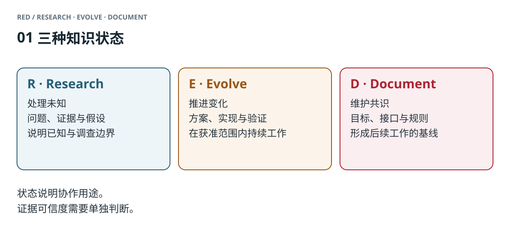
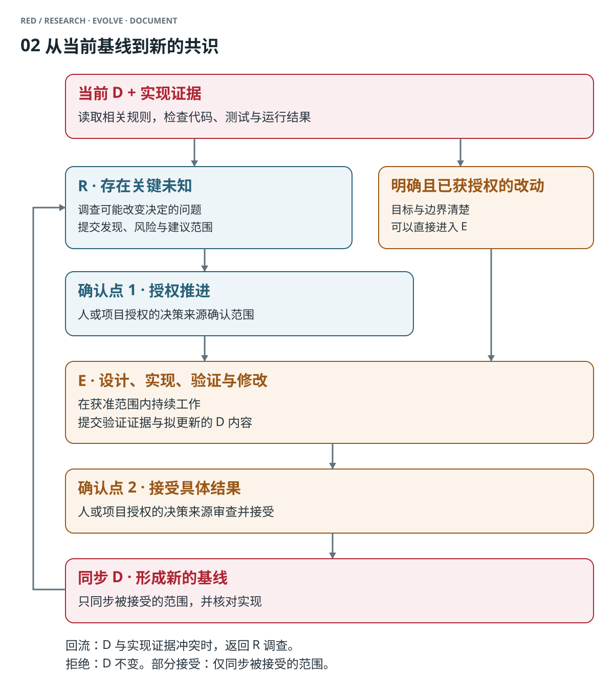
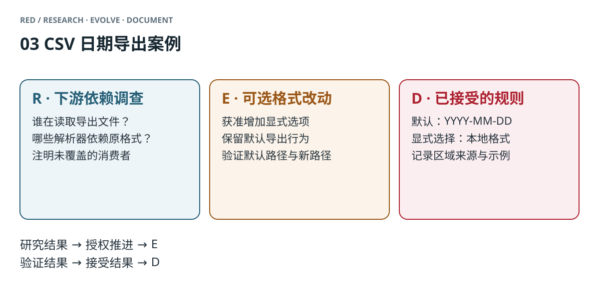

# Introducing RED：让 AI 持续理解一个项目

你让 AI 给项目加一个 CSV 导出功能。第一次对话很顺利，代码也通过了检查。两周后，你让它增加一个导出字段，它顺手改了日期格式。下游程序读不了，你翻回之前的讨论，发现它采用了一个你提过、却没有决定要做的方案。

AI 找到了与你的任务相关的内容，也写出了对应的代码。它缺少的，是那段内容在项目里究竟算什么：一个待查的问题、一项正在推进的改变，还是已经确定的规则。

从 GPT-4o 发布后开始的 AI 编程实践中，我们反复遇到这一类问题。贴 README、补充提示词、保留聊天记录，都能帮助当前对话；项目继续演进之后，我们仍然需要向 AI 重新解释哪些决定有效，哪些想法已经放弃。**让 AI 持续、正确地理解项目，逐渐成为需要单独处理的工程问题。**

我们把应对这个问题的方法称为 RED：Research、Evolve、Document。它按知识状态组织项目内容，并规定 AI 在不同状态下如何使用这些内容、推进工作，以及把结果留给下一次协作。

## 一、AI 协作中的四类困境

AI 对项目的理解，会通过下一步行动表现出来。让它修改一个函数、选择一种依赖或补充一段文档，我们就会发现它正在依赖什么。

**AI 记不住项目的根基。** 新对话里，它不知道项目服务谁、为什么选择当前架构。你解释过的离线要求没有进入项目文档，它便推荐一个依赖在线服务的方案。代码可以写得成立，项目方向却已经偏了。

**AI 混淆讨论和决定。** 你说“要不要考虑支持 iOS”，它在下一次实现里预留了相关接口。回顾材料时，那个想法和已经确认的需求都还在，却没有一处说明讨论的结果。

**你难以检查 AI 据以行动的项目理解。** 它做了一个不符合预期的设计，你需要逐步追问：它依据哪条规则？从哪里得知这个约束？它是不是把自己的推测带进了实现？如果这些依据只有对话中的零散线索，你就得先还原它的输入，再判断该改哪里。

**对话无法收口。** 你和 AI 分析问题、比较方案，聊了很多。下一次却可能从头再来；或者你为了防止遗忘，把每次总结都留下，最后得到一批相互重复、状态不明的文档。

这些困境共同指向了一个缺口：我们向 AI 提供了大量项目内容，却没有同样明确地提供这些内容的知识状态。于是，AI 在执行具体任务之前，还需要重建哪些内容可以作为行动依据。

## 二、上下文里缺少的那一部分

考虑一段交接给新 Agent 的项目摘要：

```text
CSV 导出使用 YYYY-MM-DD。
讨论过本地日期格式，用户可能更容易阅读。
可以根据系统区域设置切换格式。
下游有程序读取 CSV，兼容性还需要检查。
```

这几句话都与日期导出有关。但摘要没有告诉 Agent：其中哪一条是当前约定，哪一条只是候选方案；兼容性还没有查清时，它获准改到什么程度。

人类在协作时会作出这些区分。“先查一下”“按这个方向试”“这个定了”分别允许不同的行动。我们常常把这些判断留在当时的对话里，之后保存的文档却只剩下内容。

原始记录里可能有足够线索让 AI 恢复决定。困难在于，后续任务要反复完成这项恢复工作；一旦摘要遗漏了决定、检索没有带回相应段落，或者我们根本还没有作出决定，AI 就需要在不完整的依据上行动。

RED 将这部分判断写进项目的上下文结构。同样的材料可以表达为：

```text
D / 当前约定
默认 CSV 日期格式是 YYYY-MM-DD。

R / 待调查
哪些下游程序依赖该格式？
本地格式应使用哪个区域设置？

E / 候选改动，尚未接受
增加显式的本地格式选项，保留默认格式。
实施范围需在兼容性调查后确认。
```

现在，Agent 可以区分当前必须保持的行为、应当调查的问题和仍在成型的改变。即使它读到了旧提议，也有一份当前约定可供核对。

这里的“状态”描述内容在协作中的地位。它与事实是否可靠是两个维度：R 里的运行日志可以是可靠证据，D 对实现的描述也可能已经过时。把证据采集得更准确，以及决定项目今后要遵守什么，都需要做；RED 把后一个判断的结果显式保留下来。

## 三、RED 的三层结构

RED 按知识状态把项目内容分成三层。每一层都对应 AI 不同的工作方式。



*图 1．R、E、D 的内容与用途。证据可信度需要单独判断。[PNG 版本](assets/red-states.zh.png)。*

### R：Research，研究未知

项目初期，我们需要了解用户、技术可行性和已有系统。项目运行之后，我们还会遇到行为不明的代码、相互矛盾的资料，以及可能改变方案的新信息。R 容纳这些未知和调查过程。

AI 在 R 中读取代码、收集资料、做实验，分清观测、推断与假设。例如，它可以通过检查导入脚本确认某个程序使用固定日期解析器；“其他消费者也这样处理”仍然需要证据。

R 允许内容不完整，也允许调查后仍没有答案。值得留下的是已经知道什么、证据覆盖到哪里，以及哪个未知会影响接下来的选择。

当调查足以支持一个建议时，AI 提交发现、风险和建议范围，等待人决定是否推进改变。**得到一个可行方案，和获得实施这个方案的授权，是两件需要分别完成的事。**

### E：Evolve，推动变化

E 承载正在成型的改变：为什么改、准备怎么改、影响哪里、怎样验收，以及还有什么没解决。

在 E 中，你和 AI 可以比较方案、写代码、运行测试、试用和修改。几个方案可以同时存在，AI 也可以在获准范围内连续工作。你需要检查的是方案的依据、实际改动和验收结果。

问题和目标已经清楚、实施也已获授权时，可以直接进入 E。某个未知足以影响选择或验收条件时，先进入 R 调查。实施中发现这类未知，也需要把它提出，重新确定后续范围。

E 的内容还可能被修改或否决。因此，AI 要把“正在采用的方案”与“项目已经接受的规则”分开。验证完成之后，它提交结果以及准备更新的正式文档，由人或项目授权的流程接受。

### D：Document，沉淀共识

D 保存项目已经接受、后续工作需要依循的内容：项目目标、核心术语、接口、架构原则、使用方式和工程规则。

这些内容可以继续放在现有 README、架构说明或 API 文档中。你需要让 AI 知道哪些文档构成当前基线，并在新任务开始时先读取相关部分，再按需查看 E、R 和实现。

这改变了新对话的起点。AI 可以先知道“这个项目已经确定了什么”，然后调查或修改眼前的问题。它不必先从全部历史中拼出一份项目约定。

项目演进时，D 也要更新。改变共识需要经过 E 的推进和结果接受；不改变含义的勘误、排版整理可以直接处理。进入 D 的内容应经过相应验证和确认，适合长期阅读。理解结论所需的理由可以保留，临时讨论和工作过程留在 R/E。

## 四、一次改动如何跑完

回到 CSV 导出的例子。当前 D 规定默认日期采用 `YYYY-MM-DD`，你希望 AI 研究怎样让本地用户更方便地阅读。

可以这样开始任务：

> 先阅读现有导出约定，再检查日期格式的下游依赖。把已确认的依赖、未覆盖的情况和候选方案分开报告，等我确认范围后再实施。

AI 进入 R。它检查导出与导入代码，可能发现某个下游程序只接受当前格式。它据此建议增加显式选项、保持默认行为，并说明调查覆盖了哪些程序。你看过结果，决定推进这个范围。

E 中应当有可执行的目标和验收条件。下面是一份示意记录，选项名用于说明设计：

```text
目标：允许显式选择本地日期格式，保持默认输出兼容。
方案：新增 --date-format local，区域由 --locale 指定。
验收：
- 不传新选项时，日期仍使用 YYYY-MM-DD。
- 指定 local 与 en-GB 时，2026-09-12 输出为 12/09/2026。
- 已检查的下游解析器继续读取默认导出。
- 使用说明交代默认值、区域来源和输出示例。
```

AI 在这个范围内修改实现，检查默认路径和新增路径，并根据你的反馈调整。它完成后提交实际验证结果、没有覆盖的情况，以及拟更新的 D 内容。验收条件让你有材料判断是否接受；AI 不能用一句“测试通过”替你决定新增行为已经成为项目承诺。

你接受之后，AI 同步正式说明：

```text
CSV 日期导出
默认格式：YYYY-MM-DD。
本地格式：显式传入 --date-format local，并用 --locale 指定区域。
示例：--date-format local --locale en-GB 将 2026-09-12 导出为 12/09/2026。
下游程序需要稳定格式时，使用默认导出。
```



*图 2．AI 可以在获准的 E 范围内持续工作。R 到 E 的推进授权与 E 到 D 的结果接受，分别发生在有具体结果可审查的位置。[PNG 版本](assets/red-transitions.zh.png)。*

两个确认点都需要人或项目预先指定的决策来源作出决定。开始时宽泛的一句“全部做完”，无法替代对后来研究发现和实现结果的审查。团队可以把决定放在已有的 issue 或 PR 评审中，明确谁有权限、接受哪个范围。

方案被否决时，D 保持原状，已经尝试的实现按决定处理；部分接受时，只把接受范围写进 D。遵循现有规则的小修，可以在当前任务内完成。需要交接、评审或继续追踪时，再建立独立 R/E 记录。

**下一次对话，才是这次沉淀发挥作用的地方。** 你让另一个 Agent 增加导出字段，它先从 D 得知默认格式及选项边界，再查看相关实现。上一次调查和比较过几个方案，已经不再是它开始这项任务的必要前提。



*图 3．同一项改动在 R、E、D 中留下不同内容，后续任务按需要读取。[PNG 版本](assets/red-example.zh.png)。*

### 代码与文档发生冲突时

D 描述项目应当是什么，代码、测试和运行结果提供系统实际表现的证据。AI 需要同时使用它们。

假设 D 规定默认格式不变，运行结果却采用了本地格式。可能是实现出了偏差，也可能是一次已经接受的改动遗漏了文档同步。AI 应报告冲突并在 R 中查明原因，再由授权决定修复实现，或通过 E 调整共识。

在 R 中，AI 用实现证据调查；在 E 中，用它验证改动；更新 D 之后，仍然需要用它检查一致性。代码已经写出某种行为，不会自动赋予该行为项目规则的地位。

## 五、让 AI 对话能够收口

RED 也处理另一个长期困扰：与 AI 聊完一件事之后，成果应该留在哪里。

对话是临时工作空间。你们可以发散、争论、推翻刚才的想法。对话结束时，AI 应当按后续用途整理成果：

| 对话产生的内容 | 收口方式 |
|---|---|
| 会影响后续选择的未解问题 | 在 R 留下问题、证据和未知 |
| 已经决定推动的变化 | 在 E 明确范围、行动、验收条件与剩余工作 |
| 已接受且需要持续依循的共识 | 同步到相关 D |
| 没有后续用途的发散、重复和草稿 | 允许随对话结束而消失 |

其中的“进入 R/E”指知识状态。短小且能在当前任务完成的工作，可以直接落实；需要跨任务、跨人或跨时间继续使用的内容，才值得持久化。R/E 可以放在本地文件，也可以使用 Git、issue 或 PR，公开范围由项目决定。

一个 Agent 在调查中停下时，留下可接续的问题与证据；在实施中停下时，留下已经做到哪里和剩余工作；完成一项被接受的改变时，更新下一次会读取的正式说明。这样，新 Agent 可以从明确的状态继续，而不必再要求用户复述整个过程。

你也获得了检查 AI 工作的入口：它当前依据哪份 D，正在解决 E 中哪个问题，有哪些 R 中的假设尚未验证。发现它误解了项目，可以修正相应内容，再据此纠正实现。

## 六、更长的上下文之后，仍然需要维护什么

把全部记录放进更长的上下文，能够让 AI 获得更多材料。但一次已经结束的讨论、一个被否决的方案和一条现行规则，即使同时出现在输入中，也各有不同用途。

假设你们已经明确否决某项改动，完整历史可以帮助 AI 找到这个决定。直接维护当前状态，可以让后续任务少做一次历史还原。如果你们还没有决定，模型可以分析利弊、提出建议；项目仍然需要有人确认是否采纳。

同样，检索到一段内容，只说明找到了相关材料。使用它之前，还需要知道它属于当前规则、调查资料，还是进行中的方案。把状态与材料一起保留，能为检索、摘要和任务交接提供同一套处理依据。

RED 由此给 AI 的持续理解提出一个具体组织方式：从当前 D 获取任务所需的基线，在 R 中处理会影响决定的未知，在 E 中推进获准的改变，最后把接受的结果同步回 D。AI 既是项目知识的读取者，也参与维护下一次任务的输入。

这需要有人维护 D、判断证据和接受结果。过时的基线、含糊的确认或失去用途的记录，仍然会拖累工作。采用时可以从一个真实改动开始，检查下一次任务能否少一些重复解释，以及维护记录所花的时间是否值得。

## 七、从 AI 编程到持续协作

这套方法从 AI 编程实践中长出来。代码让问题更容易观察：AI 对一个旧提议的误读，可能直接出现在下一次提交里；我们对当前约定的维护，也可以通过随后的实现来检查。

相同的区分也可以用于与 AI 撰写报告或设计课程。访谈资料、正在修改的分析和已经确认的结论，需要在下一次工作中承担不同角色。你可以沿用已有文件，给它们明确的知识状态，并在工作完成时整理出值得继续依赖的内容。

回到最初的 CSV 场景。下一次 AI 读到“本地日期格式”时，它应该能够查到这是仍在调查的需求、正在推进的方案，还是已经接受的选项。你们之前做出的判断，应当继续约束下一次行动。

RED 把这个要求落实为一套可以持续执行的工作方式：研究未知，推动变化，沉淀共识。人和 AI 共同维护项目的当前理解，再从这份理解出发完成下一次工作。
