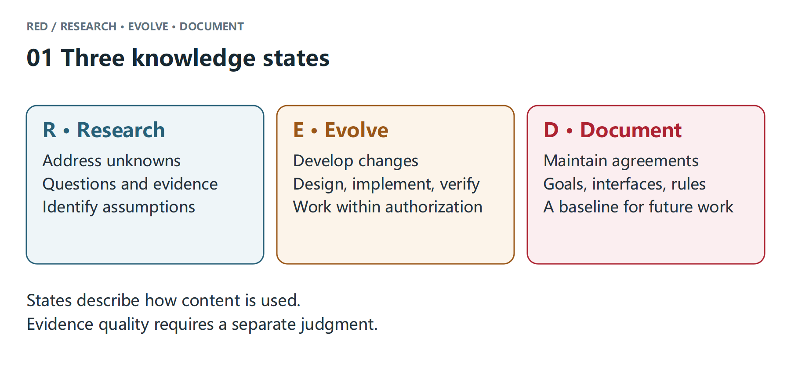
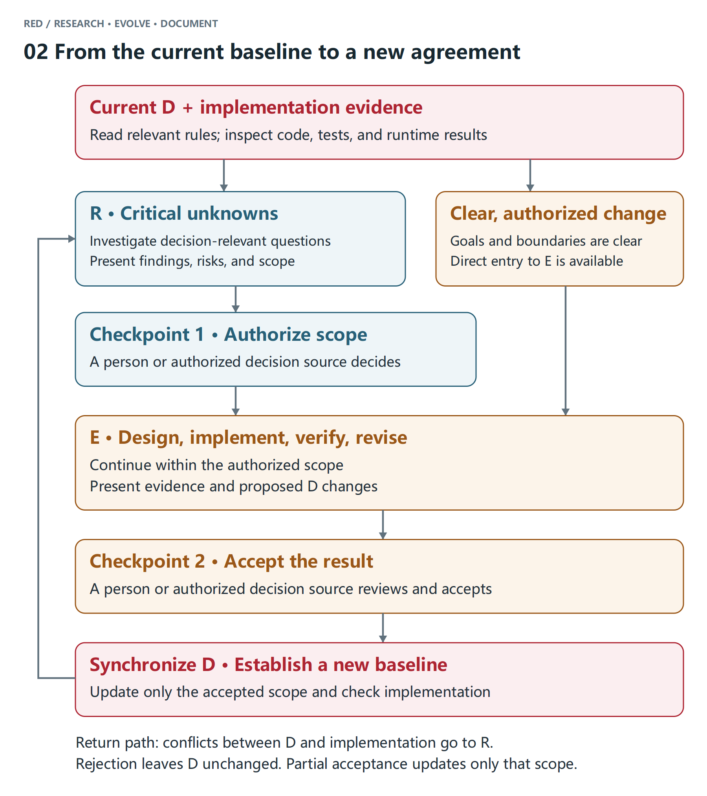

# Turn an Idea into a Project with AI: Try RED

There is a particular satisfaction in handing an idea to an AI and watching it become something usable. A few sentences that existed only in your head acquire an interface, respond to clicks, and start running. You try the first version and naturally say, “Change this part too.”

Only after using it do you discover how much was never said. How was this number calculated? Why did a feature that worked yesterday behave differently today? Did a thought that was mentioned in passing somehow become part of the implementation? You look at the result, explain what you meant, and sometimes ask the AI to undo its latest change.

The prompt then grows a few rules: analyze before editing, preserve existing behavior, ask when uncertain. Every missed detail adds another rule. Yet many details become visible only after the first version exists, and you may not have known them yourself at the beginning.

Since GPT-4o was released, we have continued using AI in software development and have become increasingly interested in this part of the collaboration. AI can already do a great deal of the work. People should also be able to clarify requirements through an ordinary conversation, let the AI investigate specialist questions, and make the trade-offs themselves. Once something is decided, it is worth keeping so that the next conversation does not begin from zero.

## Start with a report you cannot explain

Suppose you have a sales report. The sales column is clear, but today you want to know how much money was actually collected this month. You may not know which field to change or which aggregation to add. You can start with one sentence:

> I want to know how much money was collected this month, but this report does not show it. Help me work out how to change it.

The AI now has a real question to investigate. Imagine it checks the project documentation and data and finds that sales are counted by the contract month because the sales team uses that number to check performance. Payment records are stored separately, and one order may be paid in several installments.

Take one order as an example: it was signed for 10,000 in September, 3,000 arrived that month, and the remaining 7,000 arrived in October. The sales report correctly records 10,000 in September for its original purpose. If you use that number to check collections, however, it looks wrong because only 3,000 arrived that month.

The AI can now discuss a concrete choice with you: preserve the existing sales measure and show collections separately. It can explain why the two views should remain distinct instead of asking only, “What kind of report do you want?”

The existing sales definition is an accepted project convention. The AI needs to understand who relies on it before proposing a change. “The report is hard to use” is not enough authority to replace a measure used by the whole sales team.

The collections request has its own unknowns: Are all payment records complete? Can they be matched to customers? How should refunded payments be handled? You do not need to write every detail in your first sentence. The AI can inspect the data and code, then bring back both what it found and what is still uncertain.

“The system has a payment date” is a Research finding. “Add a report grouped by payment date” is a rule that still needs your confirmation. The first supports the second, but the field's existence does not mean that you have already chosen that design.

You now have enough material to decide what the new view can answer, whether the existing use will be affected, and what still needs investigation. The initial “this report is not useful” has gradually become a direction that can be implemented.

## Some requirements only appear after you use the result

After reviewing the findings, you decide to build a first internal version:

> Keep the existing sales report and add a separate collections page. Use payment dates, list refunds separately, and make it for internal use first.

This confirms the scope of one round of change. The AI can organize the fields, calculation rules, and checks, then implement them. The order paid over two months becomes a useful case for checking the new report. The original sales report also needs a regression check so that the new view does not change its meaning.

When the first version is ready, you open it and see that the amounts are correct. But a customer who paid in several installments appears on several rows, so you still have to add them manually. You say:

> Group it by customer, and let me expand each customer to see the individual payments.

This requirement became specific only after use. The AI needs to add it to the active proposal, update the implementation, and update the checks. In the next step, both sides should be able to find that the current work is a collections view with customer totals and per-payment details.

During the same conversation, you might casually ask, “Should we send automatic payment reminders later?” That idea is worth keeping, but the recipient, timing, and risk of annoying customers have not been discussed. It must stay separate from the customer grouping you just requested; otherwise the next AI session may treat both as active work.

Once you have checked several customers and accepted the result, ask the AI to update the documentation. Users need to know how to view totals and details. Developers need the fields and calculation definition. Maintainers need to know why both sales and collections measures remain. Those pages can be written from the conclusions you have already investigated and accepted.

You do not need to rewrite a complete professional specification yourself. The AI took part in the investigation and implementation, so it has the material. You decide which conclusions hold, and it writes them for the readers who will need them later. Automatic reminders remain an open research question.

## After the conversation, where does the next task start?

At this point the report exists, and you and the AI have clarified much more than the first sentence contained. One easy-to-miss question remains: can the next task find and use those decisions?

If the project only says “we discussed collections, customer totals, and automatic reminders,” all three items look similar. In a new conversation, the AI has to guess which one is accepted and which one was only mentioned.

We call the practice of separating and maintaining these kinds of knowledge RED. Research, Evolve, and Document describe three states:

- **Research: what is still being understood.** Keep the questions, findings, and proposals here. This is where you can find what the AI checked and what remains uncertain.
- **Evolve: what is being developed together.** Keep the current scope, design, progress, and acceptance conditions here. If use changes the plan, update it; if an approach is abandoned, record that as well.
- **Document: what has been accepted.** Turn confirmed conclusions into guidance that later work can follow. A project may already have this knowledge at the beginning; changing it requires another deliberate change and confirmation.



A week later, you decide to add an “owner” filter to the collections view. The project context can now be as clear as this:

> **Accepted:** Collections are grouped by payment date, and the original sales measure remains.
>
> **In progress:** Add an “owner” filter; the scope for this round is confirmed.
>
> **To investigate:** Whether automatic reminders are needed, including recipients and timing.

The AI now has a basis for preserving the sales definition, implementing the filter, and leaving automatic reminders as an open question. Even when the three pieces appear together in one context, each has a different job.

That separation is useful because it improves several moments in the work. Before editing, the AI can clarify the difference between sales and collections instead of changing the wrong measure. During use, customer totals can enter the active design and guide implementation. When the filter is added later, the accepted calculation remains in force.

The three kinds of document also guide the next action. Investigation material helps you choose a direction. The confirmed scope enters the change being developed. Once the result is accepted, the relevant guidance is updated for the next task. A new decision-relevant question sends the work back to Research; a clear, authorized change can move directly into Evolve.



You will still have new ideas, inspect results, and make trade-offs. The difference is that something clarified in one conversation has a chance to become the next conversation's starting point instead of disappearing with the chat.

## Different methods answer different questions

There are already several useful ways to help AI complete work. Each began with a particular difficulty that appeared in practice.

**Specification-driven development focuses on giving implementation a clear set of requirements.** GitHub's Spec Kit, for example, helps organize requirements, a design, and tasks before implementation. Clear goals, rules, and acceptance conditions give the AI a basis for deciding what to do; when requirements change, that basis still needs maintenance.

**Context engineering focuses on giving the AI the right information at the right time.** It selects materials, loads them on demand, organizes notes, and compresses history so the AI can maintain a task model within a limited context and avoid omissions or repeated explanations.

**Loop engineering focuses on helping the AI execute and correct itself continuously.** When actions, checks, and feedback are organized as a loop, the AI can adjust from the result instead of waiting for a person to direct every step. The loop's goal and checking criteria directly affect what it eventually completes.

These approaches have different emphases and often overlap. The practical problems in a real project cross several of them: the first idea is vague, the first version reveals a new need, a discussion settles a trade-off, and a later conversation loses part of what was decided.

RED focuses on keeping a checkable, updateable understanding of the work during this continuing collaboration. Human intent becomes clearer over time, designs change with feedback, and the AI needs to know what is still being explored, what has been authorized to move forward, and what it can already rely on. It also needs to help maintain those distinctions.

This gives the earlier difficulties one connected way to handle them. When “the report is not useful” is still vague, let the AI investigate and bring back enough evidence for a decision. When customer totals become clear only after use, update the active proposal. Once you accept the calculation, preserve it for the next task. Automatic reminders can remain a research idea even though they appeared in the same conversation.

From unclear intent to a working result and then to later changes, RED uses the same states and confirmation points to organize the work. You can fill in specialist requirements through conversation, while the AI turns those decisions into investigation, implementation, and documentation. A wrong direction, a missed piece of feedback, or a discussion mistaken for a decision each gets a place where it can be checked and corrected.

Specifications, context management, and automated loops can still do their jobs. RED connects them through a collaboration method so that what was clarified, built, and accepted this time can become the basis for the next change.

## Try it on your next small change

If you want to try this approach, start with a project you are already working on. We have packaged the workflow as an open-source Skill. Once an AI tool loads it, it has guidance for investigating, developing a change, and recording the result.

From the project directory where you are about to make a change, use Node.js 22.12 or later:

```sh
npx -y @exoticknight/red@latest skill install --scope repo
```

The command installs the Skill under `.agents/skills/red`. Use an AI coding tool that can load this directory. Before starting, ask it to read the RED Skill and tell you which file it loaded and which rules it will follow. If your tool uses another loading mechanism, follow the project's instructions¹ or ask the AI to help connect it.

Then choose a small change you were already planning, such as adding a filter to the report:

> Use RED to add an “owner” filter to this report. First check which existing conventions it could affect, and bring me a proposal where I need to decide something.

You can say “implement this scope” when the direction is clear, or ask the AI to investigate further. When it delivers a result, try it yourself; after you accept it, ask it to update the relevant guidance.

When you later say “change this part,” see whether the AI can find the earlier convention in the project documentation and distinguish accepted decisions from open questions. If you have to explain fewer things that were already settled, you have a reason to keep using the workflow.

Read the [full RED methodology](https://blog.e10t.net/red/)² for the longer explanation.

The project links and the Skill source are in the [RED repository](https://github.com/exoticknight/red). The example used in the companion practical article is [dsh-just-chat](https://github.com/exoticknight/dsh-just-chat).

[1] Project repository: https://github.com/exoticknight/red

[2] Full methodology: https://blog.e10t.net/red/
